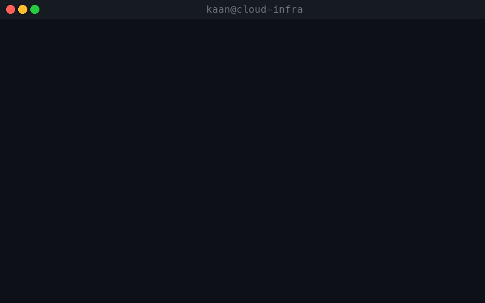

<div align="center">

<!-- TERMINAL GIF HERO -->


<br/>

# Kaan Turgut

<a href="https://git.io/typing-svg">
  
</a>

**Lead DevOps Engineer | Cloud-Native Strategist | AI + Infrastructure**

Toronto, Canada | Lenovo

[](https://www.linkedin.com/in/kaanturgut/)
[](https://medium.com/@hkaanturgut)
[](https://www.youtube.com/@hkaanturgut)
[](mailto:kaanturgutbusiness@gmail.com)


<br/>

```bash
npx hkaanturgut
```

</div>

---

<table align="center">
<tr>
<td align="center" width="200">
<br/>
<strong>Microsoft AI MVP</strong>
</td>
<td align="center" width="200">
<br/>
<strong>Azure AI Engineer</strong><br/><sub>Associate (AI-102)</sub>
</td>
<td align="center" width="200">
<br/>
<strong>Azure Solutions Architect</strong><br/><sub>Expert (AZ-305)</sub>
</td>
</tr>
</table>

---

I architect and automate cloud infrastructure at scale across Azure, AWS, and GCP. My current focus is on **bringing AI into the DevOps lifecycle** — from intelligent CI/CD troubleshooting to agentic workflows that handle incidents autonomously.

By day, I lead cloud-native strategy at Lenovo. By night, I build open-source tools and write about the intersection of **AI, infrastructure automation, and developer experience**.

---

## The Architecture of Kaan Turgut

```mermaid
%%{init: {'theme': 'dark', 'themeVariables': { 'primaryColor': '#58a6ff', 'primaryTextColor': '#c9d1d9', 'primaryBorderColor': '#30363d', 'lineColor': '#58a6ff', 'secondaryColor': '#161b22', 'tertiaryColor': '#0d1117'}}}%%

graph LR
    subgraph AI["🤖 AI & Agents"]
        A1[Azure OpenAI]
        A2[AI Foundry]
        A3[Agentic Workflows]
    end

    subgraph CICD["⚡ CI/CD"]
        C1[GitHub Actions]
        C2[Azure DevOps]
        C3[Jenkins]
    end

    subgraph IaC["🏗️ Infrastructure as Code"]
        I1[Terraform]
        I2[Bicep]
        I3[Ansible]
    end

    subgraph Cloud["☁️ Cloud"]
        CL1[Azure]
        CL2[AWS]
        CL3[GCP]
    end

    subgraph Runtime["🐳 Containers"]
        R1[Docker]
        R2[Kubernetes]
        R3[Helm / ArgoCD]
    end

    subgraph Observe["📊 Observability"]
        O1[Grafana]
        O2[Prometheus]
        O3[FinOps]
    end

    AI -->|intelligent automation| CICD
    CICD -->|deploy| IaC
    IaC -->|provision| Cloud
    Cloud -->|host| Runtime
    Runtime -->|metrics| Observe
    Observe -->|feedback loop| AI
```



---

## Featured Projects

| Project | What it does | Stack |
|---------|-------------|-------|
| [**Azure OpenAI CI/CD Troubleshooter**](https://github.com/hkaanturgut/Leveraging-Azure-Open-AI-to-Automatically-Troubleshoot-and-Solve-CI-CD-Problems) | AI-powered pipeline failure analysis and auto-remediation | Terraform, Azure OpenAI, Azure DevOps |
| [**Coding AI Agent**](https://github.com/hkaanturgut/Build-Your-Own-Coding-AI-Agent-with-Azure-AI-Foundry) | Build your own coding assistant with Azure AI Foundry | Python, Azure AI Foundry |
| [**Browser Automation Agent**](https://github.com/hkaanturgut/Browser-Automation-Agent-Microsoft-AI-Foundry) | AI agent that automates browser-based workflows | Python, Azure AI Foundry |
| [**OpenClaw Job Search Agent**](https://github.com/hkaanturgut/openclaw-job-search-agent) | Agentic job search powered by AI | Python |
| [**Agentic DevOps Team**](https://github.com/hkaanturgut/Agentic-Devops-Team-with-GitHub-Copilot) | Multi-agent DevOps team powered by GitHub Copilot | GitHub Copilot |
| [**Agent HQ Incident Response**](https://github.com/hkaanturgut/agent-hq-incident-response) | Autonomous AI agents for production incident response | Python |

---

## GitHub Stats

<div align="center">
  
  
</div>

<div align="center">
  
</div>

---

## 3D Contribution Skyline

<div align="center">
  
</div>

---

## Contribution Snake

<div align="center">
  
</div>

---

<!-- YOUTUBE:START -->
## YouTube

### Latest Videos

<table><tr>
<td align="center" width="33%">
<a href="https://www.youtube.com/watch?v=k8OWQzyBDQA">
<br/>
<strong>Find Your Dream Job While You Sleep! 😴</strong>
</a>
</td>
<td align="center" width="33%">
<a href="https://www.youtube.com/watch?v=WKJOmi9YSjM">
<br/>
<strong>I let AI Apply to jobs for me | OpenClaw</strong>
</a>
</td>
<td align="center" width="33%">
<a href="https://www.youtube.com/watch?v=dm0VqmFyrm4">
<br/>
<strong>Build Your First AI Agent with Microsoft AI Foundry</strong>
</a>
</td>
</tr></table>

### Most Watched

<div align="center">
<a href="https://www.youtube.com/watch?v=d2BWayItOv4">
<br/>
<strong>Azure AI Foundry | Introduction & Hands-on Demo</strong><br/>
<sub>15.4K views</sub>
</a>
</div>
<!-- YOUTUBE:END -->

---

## Latest Blog Posts

<!-- BLOG-POST-LIST:START -->
<!-- BLOG-POST-LIST:END -->

---

## Guestbook

Leave a message! [**Sign the guestbook**](https://github.com/hkaanturgut/hkaanturgut/issues/new?title=Guestbook:%20&body=Just%20replace%20the%20title%20with%20your%20message%20after%20%22Guestbook:%22)

<!-- GUESTBOOK:START -->
| Name | Message | Date |
|------|---------|------|
<!-- GUESTBOOK:END -->

---

<div align="center">

**Open to collaborations, consulting, and speaking opportunities.**

Let's connect — [LinkedIn](https://www.linkedin.com/in/kaanturgut/) | [kaanturgutbusiness@gmail.com](mailto:kaanturgutbusiness@gmail.com)

</div>
