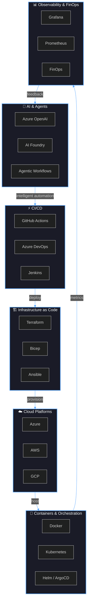

```mermaid
%%{init: {'theme': 'dark', 'themeVariables': { 'primaryColor': '#58a6ff', 'primaryTextColor': '#c9d1d9', 'primaryBorderColor': '#30363d', 'lineColor': '#58a6ff', 'secondaryColor': '#161b22', 'tertiaryColor': '#0d1117', 'background': '#0d1117'}}}%%

graph TB
    subgraph AI["🤖 AI & Agents"]
        A1[Azure OpenAI]
        A2[AI Foundry]
        A3[Agentic Workflows]
    end

    subgraph CICD["⚡ CI/CD"]
        C1[GitHub Actions]
        C2[Azure DevOps]
        C3[Jenkins]
    end

    subgraph IaC["🏗️ Infrastructure as Code"]
        I1[Terraform]
        I2[Bicep]
        I3[Ansible]
    end

    subgraph Cloud["☁️ Cloud Platforms"]
        CL1[Azure]
        CL2[AWS]
        CL3[GCP]
    end

    subgraph Runtime["🐳 Containers & Orchestration"]
        R1[Docker]
        R2[Kubernetes]
        R3[Helm / ArgoCD]
    end

    subgraph Observe["📊 Observability & FinOps"]
        O1[Grafana]
        O2[Prometheus]
        O3[FinOps]
    end

    AI -->|intelligent automation| CICD
    CICD -->|deploy| IaC
    IaC -->|provision| Cloud
    Cloud -->|host| Runtime
    Runtime -->|metrics| Observe
    Observe -->|feedback| AI

    style AI fill:#1a1b27,stroke:#58a6ff,stroke-width:2px
    style CICD fill:#1a1b27,stroke:#58a6ff,stroke-width:2px
    style IaC fill:#1a1b27,stroke:#58a6ff,stroke-width:2px
    style Cloud fill:#1a1b27,stroke:#58a6ff,stroke-width:2px
    style Runtime fill:#1a1b27,stroke:#58a6ff,stroke-width:2px
    style Observe fill:#1a1b27,stroke:#58a6ff,stroke-width:2px
```
